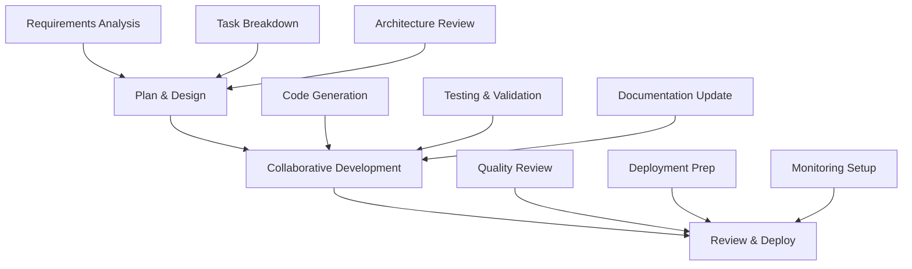

import "../_app.mdx";

# Getting Started with Compyle

Welcome to Compyle - the AI-powered development platform that collaborates with you to build better software faster. This guide will walk you through everything you need to know to get started with Compyle.

  <strong>🚀 New to Compyle?</strong> Follow this step-by-step guide to go from signup to your first completed task in under 10 minutes.

## What is Compyle?

Compyle is an intelligent development platform that uses AI agents to work alongside you throughout your development lifecycle. Unlike traditional development tools, Compyle doesn't just provide code completion or AI suggestions - it actively collaborates with you to:

- **Understand your project goals** and break them down into actionable tasks
- **Follow your coding standards** and maintain consistency across your codebase  
- **Provide intelligent code review** with contextual feedback and suggestions
- **Handle complex refactoring** while preserving your existing architecture
- **Generate comprehensive documentation** that stays in sync with your code

## Key Benefits

  
🤝

  <h3 style="font-size: 1.125rem; font-weight: 600; margin-bottom: 0.5rem; color: var(--compyle-gray-900);">Collaborative Intelligence</h3>
  
AI agents work alongside you, understanding your vision and contributing to your success.

  
⚡

  <h3 style="font-size: 1.125rem; font-weight: 600; margin-bottom: 0.5rem; color: var(--compyle-gray-900);">Accelerated Development</h3>
  
Automate routine tasks and focus on what matters most - solving complex problems.

  
🎯

  <h3 style="font-size: 1.125rem; font-weight: 600; margin-bottom: 0.5rem; color: var(--compyle-gray-900);">Quality Assurance</h3>
  
Built-in code review, testing, and validation ensure high-quality deliverables.

  
🔧

  <h3 style="font-size: 1.125rem; font-weight: 600; margin-bottom: 0.5rem; color: var(--compyle-gray-900);">Flexible Integration</h3>
  
Works with your existing tools, workflows, and development environment.

## Platform Overview

### The Compyle Workflow

Compyle follows a proven three-phase development process that ensures quality, speed, and collaboration:

### Core Components

- **AI Agents**: Specialized intelligent agents that handle different aspects of development
- **Task Engine**: Breaks down complex requirements into manageable tasks
- **Code Review System**: Provides intelligent feedback and suggestions
- **Integration Hub**: Connects with your existing tools and workflows
- **Analytics Dashboard**: Tracks progress, quality metrics, and team performance

## Getting Started Prerequisites

Before you begin, make sure you have:

- ✅ **A GitHub, GitLab, or Bitbucket account** for code repository integration
- ✅ **Basic familiarity with version control** (Git commands and concepts)
- ✅ **A development project** you want to work on or improve
- ✅ **Administrative access** to your code repositories
- ✅ **About 10-15 minutes** to complete the setup process

  <strong>💡 Pro Tip:</strong> Start with a smaller project to get familiar with Compyle's workflow before tackling your main codebase.

## Quick Start Guide

Follow these steps to get up and running with Compyle:

  
1

  

    <h4 style="margin: 0 0 0.5rem 0; font-size: 1.125rem; font-weight: 600;">Create Your Account</h4>
    
Sign up for Compyle and complete the initial setup process.

    <a href="/getting-started/signup" style="display: inline-block; margin-top: 0.5rem; color: var(--compyle-primary); text-decoration: none; font-weight: 500;">Sign Up →</a>
  

  
2

  

    <h4 style="margin: 0 0 0.5rem 0; font-size: 1.125rem; font-weight: 600;">Connect Your Repository</h4>
    
Link your code repository to enable Compyle's development capabilities.

    <a href="/getting-started/connect-repo" style="display: inline-block; margin-top: 0.5rem; color: var(--compyle-primary); text-decoration: none; font-weight: 500;">Connect Repository →</a>
  

  
3

  

    <h4 style="margin: 0 0 0.5rem 0; font-size: 1.125rem; font-weight: 600;">Create Your First Task</h4>
    
Define your first development task and watch Compyle's agents get to work.

    <a href="/getting-started/first-task" style="display: inline-block; margin-top: 0.5rem; color: var(--compyle-primary); text-decoration: none; font-weight: 500;">Create Task →</a>
  

  
4

  

    <h4 style="margin: 0 0 0.5rem 0; font-size: 1.125rem; font-weight: 600;">Review and Deploy</h4>
    
Review the generated code, provide feedback, and deploy your changes.

    <a href="/getting-started/agent-workflow-intro" style="display: inline-block; margin-top: 0.5rem; color: var(--compyle-primary); text-decoration: none; font-weight: 500;">Review Workflow →</a>
  

## Next Steps

Once you've completed the setup process, you might want to explore:

- **[Custom Rules & Patterns](/features/custom-rules)** - Set up coding standards and validation rules
- **[Code Review & Validation](/features/code-review)** - Understand how Compyle provides intelligent feedback  
- **[Agent Workflow Deep Dive](/features/agent-workflow-deep-dive)** - Learn advanced agent capabilities
- **[API Reference](/api-reference/intro)** - Integrate Compyle into your existing workflows

  <strong>📚 Need Help?</strong> Check out our [FAQ](/faq) section for answers to common questions, or visit our [Community](/community) for support from other users.

